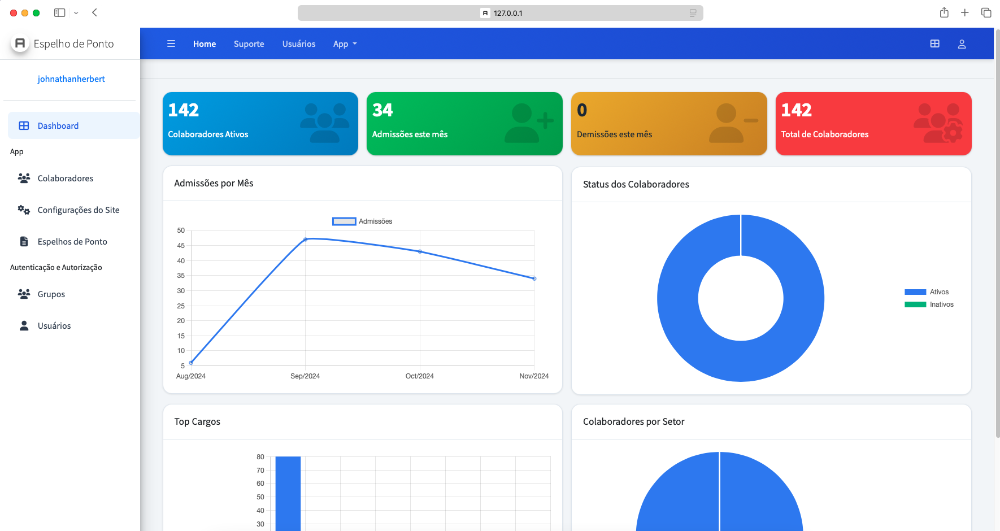

# 📊 Espelho de Ponto Digital

  

  
  
  
  

Sistema de gerenciamento de espelho de ponto digital desenvolvido com Django e Jazzmin, oferecendo uma interface moderna e intuitiva para gestão de registros de ponto dos colaboradores.

## ✨ Funcionalidades

- 👥 **Gestão de Colaboradores**

  - Cadastro completo de funcionários
  - Histórico de admissão/demissão
  - Informações detalhadas de cargo e setor

- 📄 **Espelho de Ponto**

  - Upload de arquivos PDF
  - Visualização individual por colaborador
  - Histórico de registros

- 🔐 **Controle de Acesso**

  - Sistema de autenticação robusto
  - Níveis de permissão personalizáveis
  - Gestão de usuários e grupos

- 🎨 **Interface Administrativa**
  - Design responsivo e moderno
  - Tema customizável (modo claro/escuro)
  - Dashboard interativo

## 🛠️ Tecnologias Utilizadas

- **Backend**

  - Python 3.9+
  - Django 5.0+
  - Django Jazzmin
  - SQLite3

- **Frontend**
  - HTML5
  - CSS3
  - JavaScript
  - Bootstrap 5

## 📱 Telas do Sistema

  <table>
    <tr>
      <td align="center" width="50%">
        
         
        <em>Dashboard Administrativo</em>
      </td>
      <td align="center" width="50%">
        
         
        <em>Busca de Espelho de Ponto</em>
      </td>
    </tr>
  </table>

## 📋 Requisitos do Sistema

- Python 3.9 ou superior
- Pip (gerenciador de pacotes Python)
- Navegador web moderno
- 512MB RAM (mínimo)
- 1GB de espaço em disco

## 📝 Licença

Este projeto está sob a licença MIT. Veja o arquivo [LICENSE](LICENSE) para mais detalhes.

## 👨‍💻 Autor

**Seu Nome**

- GitHub: [@johnathanherbert](https://github.com/seu-usuario)
- LinkedIn: [@johnathanherbert47](https://linkedin.com/in/johnathanherbert47)

## 📮 Contato

Para sugestões, dúvidas ou reportar problemas, entre em contato através das issues do GitHub ou pelo email: johnathanherbert47@gmail.com

## 🔍 Status do Projeto

O projeto está em desenvolvimento ativo. Novas funcionalidades são adicionadas regularmente.

---

  Feito com ❤️ por <a href="https://github.com/johnathanherbert">Johnathan Herbert</a>

